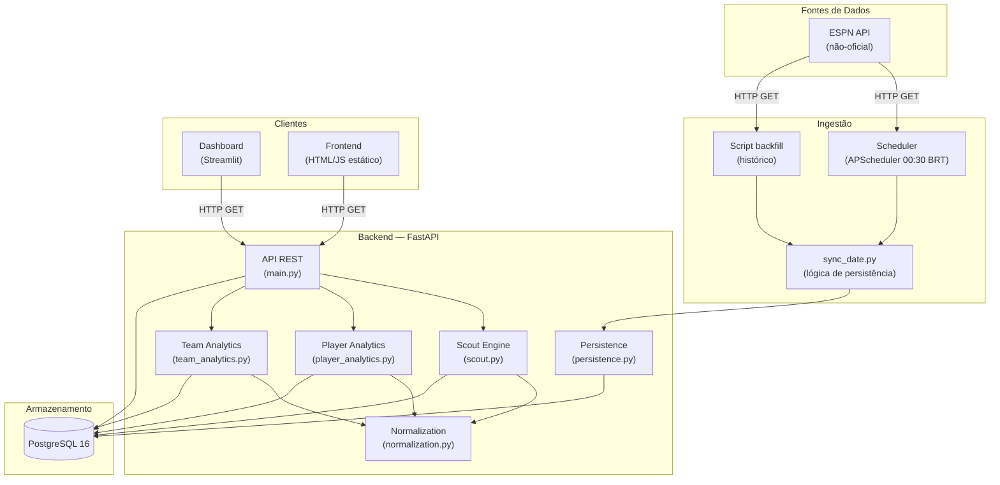
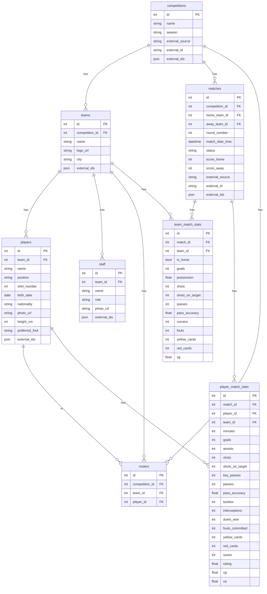
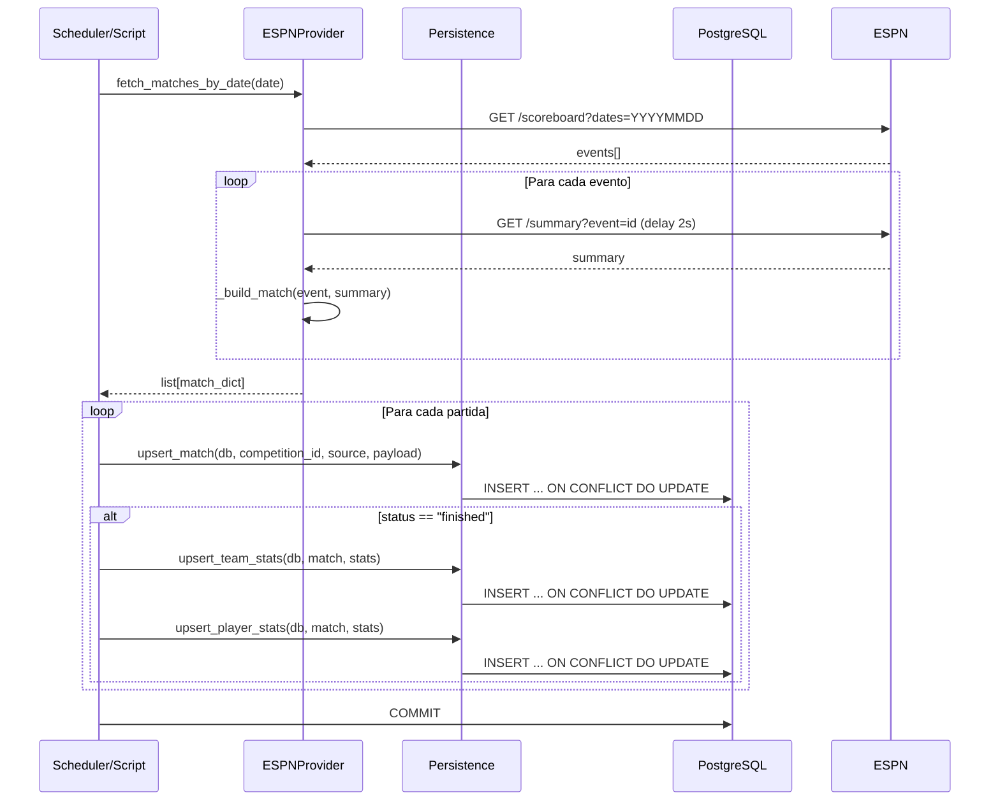

# Design Técnico — Scout Platform

## Visão Geral

A Scout Platform é um sistema de scouting de futebol para o Brasileirão Série A 2026,
composto por três camadas independentes que se comunicam via API REST:

- **API (FastAPI/Python)**: backend central que expõe todos os dados e lógica de negócio
- **Dashboard (Streamlit)**: interface analítica para scouts, consome a API via HTTP
- **Frontend (HTML/JS estático)**: interface de perfil de times, hospedada no Cloudflare Pages

Os dados são ingeridos automaticamente da ESPN via scheduler diário e persistidos em PostgreSQL.

---

## Arquitetura



### Decisões de Arquitetura

- **Monólito modular**: toda a lógica de negócio vive no mesmo processo FastAPI, separada em
  módulos de serviço. Não há microserviços — o volume de dados não justifica a complexidade.
- **Ingestão desacoplada**: o scheduler e os scripts de backfill são processos separados da API,
  compartilhando apenas os modelos SQLAlchemy e o serviço de persistência.
- **Frontend estático**: o `index.html` não tem build step — é servido diretamente pelo
  Cloudflare Pages, eliminando dependência de servidor de aplicação.
- **Dashboard como cliente**: o Streamlit consome a API via HTTP como qualquer outro cliente,
  sem acesso direto ao banco.

---

## Componentes e Interfaces

### ESPN Provider (`backend/app/providers/espn.py`)

Responsável por toda comunicação com a API não-oficial da ESPN.

| Método | Descrição |
|--------|-----------|
| `fetch_matches_by_date(date)` | Busca todas as partidas do Brasileirão em uma data |
| `fetch_match_summary(espn_game_id)` | Retorna o JSON bruto de uma partida (debug) |
| `_get(url, params)` | HTTP GET com retry (3 tentativas, backoff 5s) |
| `_build_match(event, summary)` | Combina scoreboard + summary no formato interno |
| `_parse_team_stats(summary)` | Extrai estatísticas de time do boxscore |
| `_parse_player_stats(summary)` | Extrai estatísticas de jogadores dos rosters |

**Contrato de saída** de `fetch_matches_by_date`:
```python
{
    "external_id": str,
    "date": str,           # ISO 8601
    "home_team": str,
    "away_team": str,
    "score_home": int | None,
    "score_away": int | None,
    "status": "finished" | "scheduled" | "in_progress",
    "round": int | None,
    "team_stats": list[TeamStatsDict],
    "player_stats": list[PlayerStatsDict],
}
```

### Persistence Service (`backend/app/services/persistence.py`)

Realiza upsert de todas as entidades. Operações idempotentes — podem ser chamadas múltiplas
vezes com os mesmos dados sem criar duplicatas.

| Função | Chave de upsert |
|--------|----------------|
| `upsert_match` | `external_source` + `external_id` |
| `upsert_team_stats` | `match_id` + `team_id` |
| `upsert_player_stats` | `match_id` + `player_id` |

Resolução de jogadores (em ordem de prioridade):
1. Lookup por `external_ids['espn']`
2. Fallback por nome dentro do time (primeira sincronização)
3. Criação automática se `external_id` presente e jogador não encontrado

### Scout Engine (`backend/app/services/scout.py`)

Calcula rankings e scores de jogadores por grupo posicional. Ver seção "Scout Engine" abaixo.

### Player Analytics (`backend/app/services/player_analytics.py`)

| Função | Descrição |
|--------|-----------|
| `get_player_averages(db, player_id, competition_id, window)` | Médias das últimas N partidas |
| `get_player_radar(db, player_id, competition_id, window, min_matches, min_players)` | Scores normalizados 0-100 |
| `get_player_timeseries(db, player_id, competition_id)` | Métricas por rodada |
| `get_last_matches(db, player_id, competition_id, window)` | Lista das últimas N partidas |

### Team Analytics (`backend/app/services/team_analytics.py`)

| Função | Descrição |
|--------|-----------|
| `get_team_averages(db, team_id, competition_id, window)` | Médias das últimas N partidas |
| `get_team_radar(db, team_id, competition_id, window, min_matches, min_teams)` | Scores normalizados 0-100 |
| `get_team_timeseries(db, team_id, competition_id)` | Métricas por rodada |
| `get_team_trend(db, team_id, competition_id, window)` | Tendência de forma (W/D/L) |
| `get_last_matches(db, team_id, competition_id, window)` | Lista das últimas N partidas |

### API REST (`backend/app/main.py`)

Todos os endpoints são read-only (GET). Escrita ocorre apenas via scripts de ingestão.

#### Contratos de Endpoints

**Competições e Times**
```
GET /competitions
  → list[CompetitionOut]
  → 200 OK

GET /competitions/{competition_id}/teams
  → list[TeamOut]
  → 404 se competition_id não existir

GET /teams/{team_id}
  → TeamOut
  → 404 se team_id não existir

GET /teams/{team_id}/squad
  → TeamSquadOut { team, players[], staff[] }
  → 404 se team_id não existir

GET /teams/{team_id}/matches
  → list[MatchOut]  (ordenado por data desc)
  → 404 se team_id não existir
```

**Analytics de Time**
```
GET /teams/{team_id}/analytics/summary?competition_id&window=5
  → TeamAnalyticsSummary { team_id, competition_id, window, averages, trend, last_matches }
  → 404 se team não pertencer à competition

GET /teams/{team_id}/analytics/radar?competition_id&window=5&min_matches=3&min_teams=6
  → TeamRadar { ..., eligible_teams, metrics, note }
  → note="insufficient sample" se eligible_teams < min_teams

GET /teams/{team_id}/analytics/timeseries?competition_id
  → list[TeamTimeSeriesPoint { round_number, match_date, metrics }]
```

**Jogadores**
```
GET /players/{player_id}
  → PlayerDetailOut (inclui team)
  → 404 se player_id não existir

GET /players/{player_id}/analytics/summary?competition_id&window=5
  → PlayerAnalyticsSummary { player_id, competition_id, window, averages, last_matches }
  → 404 se jogador não pertencer à competition

GET /players/{player_id}/analytics/radar?competition_id&window=5&min_matches=3&min_players=30
  → PlayerRadar { ..., eligible_players, metrics, note }
  → note="insufficient sample" se eligible_players < min_players

GET /players/{player_id}/analytics/timeseries?competition_id
  → list[PlayerTimeSeriesPoint { round_number, match_date, metrics }]
```

**Partidas**
```
GET /matches?competition_id&limit=100&offset=0
  → list[MatchOut]  (ordenado por data asc)

GET /matches/{match_id}
  → MatchOut (inclui home_team e away_team)
  → 404 se match_id não existir

GET /matches/{match_id}/stats
  → list[TeamMatchStatsOut]  (mandante primeiro)
  → 404 se match_id não existir
```

**Scout**
```
GET /scout/ranking?competition_id&position&min_minutes=180&limit=100&offset=0
  → list[ScoutRanking]  (ordenado por score desc)
  → 400 se position inválida
  → 404 se competition_id não existir

GET /scout/player/{player_id}?competition_id&min_minutes=180
  → PlayerScoutCard (inclui rank)
  → 422 se posição do jogador não mapeável
  → 404 se jogador não aparecer no ranking
```

### Frontend (`frontend/index.html`)

Arquivo HTML único com CSS e JS inline. Sem framework, sem build step.

**Estrutura de componentes (lógica JS)**:
```
App
├── Sidebar
│   ├── SearchInput (filtro em tempo real)
│   ├── TeamList (desktop) / TeamSelect (mobile ≤768px)
│   └── ErrorBanner (falha ao carregar times)
└── MainContent
    ├── SkeletonLoader (durante carregamento, timeout 10s)
    ├── ErrorBanner (falha ao carregar perfil)
    └── TeamProfile
        ├── TeamHero (logo, nome, cidade)
        ├── KPIGrid (jogos, V/E/D, gols pró/contra)
        ├── LastResults (últimos 5 resultados)
        └── SquadSection
            ├── FormationHeader (ex: "4-3-3")
            ├── PitchSVG (11 titulares posicionados)
            └── BenchList (reservas)
```

**Fluxo de estado**:
```
init → fetchCompetitions() → fetchTeams(competition_id)
     → renderSidebar()

selectTeam(team_id) → showSkeleton()
                    → Promise.all([
                        fetchTeamMatches(team_id),
                        fetchTeamSquad(team_id),
                        fetchTeamAnalytics(team_id, competition_id)
                      ])
                    → renderTeamProfile()
                    → hideSkeletonOrTimeout(10s)
```

**Mapeamento de posições ESPN → coordenadas SVG**:

| Posição ESPN | Grupo | x | y |
|---|---|---|---|
| Goalkeeper | Goleiro | 50% | 88% |
| Left Back | Defensor | 15% | 70% |
| Center Left Defender | Defensor | 35% | 70% |
| Center Right Defender | Defensor | 65% | 70% |
| Right Back | Defensor | 85% | 70% |
| Defensive Midfielder | Meio-campo | 50% | 52% |
| Left Midfielder | Meio-campo | 20% | 45% |
| Right Midfielder | Meio-campo | 80% | 45% |
| Center Midfielder | Meio-campo | 50% | 45% |
| Attacking Midfielder | Meio-campo | 50% | 35% |
| Forward / Center Forward | Atacante | 50% | 18% |
| Left Forward | Atacante | 25% | 18% |
| Right Forward | Atacante | 75% | 18% |

**Cores por grupo posicional**:
- Goleiro: `#22c55e` (verde)
- Defensor: `#3b82f6` (azul)
- Meio-campo: `#a855f7` (roxo)
- Atacante: `#f97316` (laranja)

### Dashboard (`dashboard/app.py`)

Interface Streamlit com duas páginas (via `st.session_state.page`):

**Página: Ranking**
- Filtros na sidebar: competição, posição, mínimo de minutos
- Tabela com highlight ouro/prata/bronze (linhas 1/2/3)
- Ícone 🔍 para Joias Escondidas (score ≥ 60 e minutos ≤ 270)
- Selectbox de jogadores para navegar ao card

**Página: Card do Jogador**
- Botão "← Voltar" (mantém filtros via `st.session_state`)
- Nome, time, posição, score, minutos, partidas
- Radar chart Plotly (eixo radial 0-100, valores normalizados)
- Tabela de métricas brutas
- Badge "🔍 Joia Escondida" quando aplicável

---

## Modelo de Dados



### Índices e Constraints

| Tabela | Constraint | Colunas |
|--------|-----------|---------|
| `matches` | UNIQUE | `external_source`, `external_id` |
| `team_match_stats` | UNIQUE | `match_id`, `team_id` |
| `player_match_stats` | UNIQUE | `match_id`, `player_id` |
| `matches` | INDEX | `competition_id`, `match_date_time` |
| `player_match_stats` | INDEX | `match_id`, `player_id` |
| `team_match_stats` | INDEX | `match_id`, `team_id` |

---

## Scout Engine

O Scout Engine calcula um score de 0 a 100 para cada jogador dentro do seu grupo posicional,
permitindo comparação relativa entre jogadores da mesma função.

### Grupos Posicionais e Métricas

| Grupo | Métricas (positivas) | Métricas (invertidas) |
|-------|---------------------|----------------------|
| Goleiro | saves_p90, clean_sheet_rate | goals_conceded_p90, yellow_cards_p90 |
| Defensor | goals_p90, assists_p90, shots_p90 | fouls_p90, yellow_cards_p90, red_cards_p90 |
| Meio-campo | goals_p90, assists_p90, shots_p90, shots_on_target_p90 | fouls_p90, yellow_cards_p90 |
| Atacante | goals_p90, assists_p90, shots_p90, shots_on_target_p90, conversion_rate | yellow_cards_p90 |

### Algoritmo de Score

```
Para cada jogador elegível (total_minutes ≥ min_minutes):

1. Calcular métricas brutas acumuladas (soma de todas as partidas)

2. Calcular métricas p90:
   metric_p90 = metric_total / (total_minutes / 90)

3. Métricas especiais de Goleiro:
   - goals_conceded: derivado de Match.score_home/away + TeamMatchStats.is_home
   - clean_sheet_rate = clean_sheets / matches_played

4. Para cada métrica, normalizar entre todos os jogadores elegíveis do grupo:
   score_i = (value_i - min) / (max - min) * 100
   Se max == min → score = 50 para todos

5. Para métricas invertidas:
   score_i = 100 - score_i

6. Score final = média aritmética de todos os metric_scores
```

### Mapeamento ESPN → Grupo Posicional

```python
POSITION_GROUPS = {
    "Goalkeeper": "Goleiro",
    "Defender": "Defensor",
    "Center Defender": "Defensor",
    "Left Back": "Defensor",
    "Right Back": "Defensor",
    "Midfielder": "Meio-campo",
    "Center Midfielder": "Meio-campo",
    "Defensive Midfielder": "Meio-campo",
    "Attacking Midfielder": "Meio-campo",
    "Forward": "Atacante",
    "Left Forward": "Atacante",
    "Right Forward": "Atacante",
    "Substitute": None,  # não ranqueável
}
```

### Joia Escondida

Critério: `score >= 60 AND total_minutes <= 270`

Indica jogadores com alta performance relativa mas com poucos minutos jogados —
potencialmente subutilizados ou recém-chegados ao time.

---

## Sincronização ESPN

### Fluxo de Dados



### Tratamento de Erros na Ingestão

| Cenário | Comportamento |
|---------|--------------|
| Erro HTTP no summary | Log warning, retorna metadados sem stats, continua o lote |
| Time não encontrado no banco | Log warning, ignora stats daquele time, continua |
| Jogador não encontrado sem external_id | Log warning, pula o jogador |
| Falha após 3 tentativas de retry | Lança exceção, aborta a data |
| Partida não finalizada | Persiste metadados, pula stats |

### Scheduler

- Executa diariamente às **00:30 BRT** (America/Sao_Paulo)
- Sincroniza o dia anterior (garante que jogos das 23h30 já finalizaram)
- Exceções são capturadas e logadas sem matar o processo
- Configurável via `SCOUT_COMPETITION_ID` (env var, default: 1)

---

## Infraestrutura

### Docker Compose

```yaml
# infra/docker-compose.yml (atual — apenas banco)
services:
  db:
    image: postgres:16
    ports: ["5433:5432"]
    volumes: [scout_pgdata:/var/lib/postgresql/data]
```

**Gap identificado**: a API não está no docker-compose atual. Para subir tudo com um comando,
adicionar o serviço `api`:

```yaml
  api:
    build: ../backend
    ports: ["8000:8000"]
    environment:
      DATABASE_URL: postgresql+psycopg2://scout:scout@db:5432/scout
    depends_on: [db]
    command: >
      sh -c "alembic upgrade head && uvicorn app.main:app --host 0.0.0.0 --port 8000"
```

### Migrações

Gerenciadas pelo Alembic. Executadas automaticamente no startup da API (via comando no
container) ou manualmente com `alembic upgrade head`.

Migrações existentes (em ordem):
1. `25024cdcdc88` — init camada 0 (tabelas base)
2. `a1b2c3d4e5f6` — add match stats
3. `b3c4d5e6f7a8` — camada 2 FPF fields
4. `c7d8e9f0a1b2` — camada 3 sync keys
5. `d1e2f3a4b5c6` — camada 3.2 player stats
6. `e1f2a3b4c5d6` — round_number nullable
7. `f1a2b3c4d5e6` — add saves to player_match_stats
8. `209171472d94` — player stats columns

### Deploy

| Componente | Plataforma | Método |
|-----------|-----------|--------|
| API | VPS / container | Docker + uvicorn |
| PostgreSQL | VPS / container | Docker volume persistente |
| Frontend | Cloudflare Pages | Deploy de arquivo estático |
| Dashboard | Local / VPS | `streamlit run dashboard/app.py` |

**Variáveis de ambiente necessárias**:
```
DATABASE_URL          # ou DB_HOST/DB_PORT/DB_NAME/DB_USER/DB_PASSWORD
SCOUT_COMPETITION_ID  # default: 1
API_BASE              # usado pelo Frontend e Dashboard para apontar para a API
```

---

## Tratamento de Erros

### API

| Situação | HTTP | Mensagem |
|----------|------|---------|
| competition_id não existe | 404 | "Competition not found" |
| team_id não existe | 404 | "Team not found" |
| team não pertence à competition | 404 | "Team not found in competition" |
| player_id não existe | 404 | "Player not found" |
| player não pertence à competition | 404 | "Player not found in competition" |
| match_id não existe | 404 | "Match not found" |
| position inválida no ranking | 400 | "Invalid position. Must be one of: ..." |
| posição do jogador não mapeável | 422 | "Player position '...' is not rankable." |
| jogador sem minutos suficientes | 404 | "Player not found in ranking ..." |

### Frontend

- Skeleton animado durante carregamento
- Timeout de 10 segundos → exibe mensagem de timeout
- Erro ao carregar times → banner de erro na sidebar
- Erro ao carregar perfil → banner de erro na área principal
- Logo não carregável → `onerror` oculta o elemento ``

### ESPN Provider

- Retry com backoff exponencial (3 tentativas, 5s entre elas)
- Degradação graciosa: summary com erro retorna partida sem stats
- Delay de 2s entre chamadas de summary (cortesia à API)

---

## Propriedades de Corretude

*Uma propriedade é uma característica ou comportamento que deve ser verdadeiro em todas as execuções válidas de um sistema — essencialmente, uma declaração formal sobre o que o sistema deve fazer. Propriedades servem como ponte entre especificações legíveis por humanos e garantias de corretude verificáveis por máquina.*

---

### Propriedade 1: Estrutura de saída do ESPN Provider

*Para qualquer* data válida passada ao `ESPNProvider._build_match`, o objeto retornado deve conter as chaves obrigatórias: `external_id`, `date`, `home_team`, `away_team`, `status`, `team_stats` e `player_stats`.

**Validates: Requirements 1.1**

---

### Propriedade 2: Degradação graciosa em erro de summary

*Para qualquer* lote de eventos ESPN onde um ou mais summary calls falham com erro HTTP, o método `fetch_matches_by_date` deve retornar uma lista com o mesmo número de partidas que o scoreboard retornou, e as partidas com erro devem ter `team_stats` e `player_stats` como listas vazias.

**Validates: Requirements 1.2**

---

### Propriedade 3: Idempotência do upsert de persistência

*Para qualquer* payload de partida válido, chamar as funções de upsert (`upsert_match`, `upsert_team_stats`, `upsert_player_stats`) duas vezes consecutivas com os mesmos dados deve produzir exatamente o mesmo estado no banco de dados que chamar uma única vez — sem duplicatas de linhas.

**Validates: Requirements 1.5**

---

### Propriedade 4: Tratamento de time desconhecido na persistência

*Para qualquer* payload de partida que contenha um nome de time não cadastrado no banco, a função `process_date_matches` deve completar sem lançar exceção e não deve persistir estatísticas para aquele time desconhecido.

**Validates: Requirements 1.6**

---

### Propriedade 5: Cobertura de intervalo de datas no backfill

*Para qualquer* intervalo de datas `[start, end]`, o script de backfill deve invocar `process_date_matches` exatamente uma vez para cada data no intervalo, sem pular nem repetir datas.

**Validates: Requirements 1.8**

---

### Propriedade 6: Ordenação da lista de competições

*Para qualquer* conjunto de competições no banco de dados, o endpoint `GET /competitions` deve retornar a lista ordenada lexicograficamente pelo campo `name` em ordem crescente.

**Validates: Requirements 2.1**

---

### Propriedade 7: Ordenação da lista de times

*Para qualquer* competição com times cadastrados, o endpoint `GET /competitions/{competition_id}/teams` deve retornar a lista ordenada lexicograficamente pelo campo `name` em ordem crescente.

**Validates: Requirements 2.2**

---

### Propriedade 8: Filtro de times no Frontend

*Para qualquer* lista de times e qualquer string de busca, a função de filtro do Frontend deve retornar apenas os times cujo `name` contém a string de busca (case-insensitive), e nenhum time cujo nome não contenha a string deve aparecer no resultado.

**Validates: Requirements 2.6**

---

### Propriedade 9: Ordenação de partidas do time

*Para qualquer* time com partidas cadastradas, o endpoint `GET /teams/{team_id}/matches` deve retornar a lista ordenada por `match_date_time` em ordem decrescente (mais recente primeiro).

**Validates: Requirements 3.2**

---

### Propriedade 10: Completude do elenco

*Para qualquer* time com jogadores e comissão técnica cadastrados, o endpoint `GET /teams/{team_id}/squad` deve retornar todos os jogadores e todos os membros da comissão técnica associados ao time — sem omitir nenhum registro presente no banco.

**Validates: Requirements 3.3**

---

### Propriedade 11: Ordenação do ranking de scouting

*Para qualquer* combinação válida de `competition_id`, `position` e `min_minutes`, o endpoint `GET /scout/ranking` deve retornar a lista de jogadores ordenada por `score` em ordem decrescente (maior score primeiro).

**Validates: Requirements 4.1**

---

### Propriedade 12: Corretude do cálculo p90

*Para qualquer* jogador com `total_minutes > 0` e valor de métrica `v`, o valor p90 calculado deve ser igual a `v / (total_minutes / 90)`, com tolerância de ponto flutuante de 1e-9.

**Validates: Requirements 4.3**

---

### Propriedade 13: Invariante de range da normalização

*Para qualquer* lista de valores numéricos com pelo menos dois elementos distintos, após aplicar `_normalize`:
- Todos os valores normalizados devem estar no intervalo `[0.0, 100.0]`
- O valor mínimo original deve mapear para `0.0` (ou `100.0` se invertido)
- O valor máximo original deve mapear para `100.0` (ou `0.0` se invertido)
- Quando todos os valores são iguais, todos os scores normalizados devem ser `50.0`

**Validates: Requirements 4.4, 4.5, 4.7**

---

### Propriedade 14: Score como média aritmética

*Para qualquer* jogador com scores normalizados por métrica `[s1, s2, ..., sn]`, o `score` final calculado pelo Scout Engine deve ser igual à média aritmética `(s1 + s2 + ... + sn) / n`, com tolerância de ponto flutuante de 1e-9.

**Validates: Requirements 4.6**

---

### Propriedade 15: Completude do card de jogador

*Para qualquer* jogador presente no ranking, o endpoint `GET /scout/player/{player_id}` deve retornar um objeto contendo todos os campos obrigatórios: `player_id`, `player_name`, `team_name`, `position`, `total_minutes`, `matches_played`, `score`, `rank` e `metrics`.

**Validates: Requirements 5.1**

---

### Propriedade 16: Restrição de janela nos analytics

*Para qualquer* time ou jogador e qualquer valor de `window`, as médias retornadas pelos endpoints de analytics summary devem ser calculadas usando no máximo as `window` partidas mais recentes — nunca mais do que isso.

**Validates: Requirements 3.1, 6.1, 7.1**

---

### Propriedade 17: Invariante de range dos scores de radar

*Para qualquer* time ou jogador com amostra suficiente, todos os scores de métricas retornados pelos endpoints de radar devem estar no intervalo `[0.0, 100.0]` ou ser `null` (amostra insuficiente).

**Validates: Requirements 6.2, 7.2**

---

### Propriedade 18: Ordenação das séries temporais

*Para qualquer* time ou jogador, o endpoint de timeseries deve retornar os pontos ordenados por `round_number` em ordem crescente (rodada mais antiga primeiro).

**Validates: Requirements 6.3, 7.3**

---

### Propriedade 19: Ordenação da lista de partidas

*Para qualquer* competição com partidas cadastradas, o endpoint `GET /matches?competition_id=X` deve retornar a lista ordenada por `match_date_time` em ordem crescente (mais antiga primeiro).

**Validates: Requirements 8.1**

---

### Propriedade 20: Completude dos dados de partida

*Para qualquer* partida cadastrada, o endpoint `GET /matches/{match_id}` deve retornar um objeto contendo todos os campos obrigatórios: `id`, `competition_id`, `round_number`, `match_date_time`, `status`, `score_home`, `score_away`, `home_team` (com `id` e `name`) e `away_team` (com `id` e `name`).

**Validates: Requirements 8.2, 8.5**

---

### Propriedade 21: Mandante primeiro nas estatísticas de partida

*Para qualquer* partida com estatísticas de time cadastradas, o endpoint `GET /matches/{match_id}/stats` deve retornar o time mandante (`is_home=True`) como primeiro elemento da lista.

**Validates: Requirements 8.3**

---

### Propriedade 22: Completude dos dados de jogador

*Para qualquer* jogador cadastrado, o endpoint `GET /players/{player_id}` deve retornar um objeto contendo: `id`, `name`, `position`, `shirt_number`, `birth_date`, `nationality`, `photo_url`, `height_cm`, `preferred_foot`, e o objeto `team` com pelo menos `id` e `name`.

**Validates: Requirements 9.1, 9.2**

---

### Propriedade 23: Comportamento de paginação

*Para qualquer* endpoint paginável (`GET /matches`, `GET /scout/ranking`) com `N` resultados totais, ao usar `limit=L` e `offset=O`:
- A resposta deve conter no máximo `L` itens
- Os itens retornados devem ser os itens de índice `[O, O+L)` da lista completa ordenada
- Quando `limit` não é fornecido, o padrão deve ser 100

**Validates: Requirements 12.1, 12.2, 12.3**

---

## Estratégia de Testes

### Abordagem Dual

A plataforma usa dois tipos complementares de teste:

- **Testes unitários**: verificam exemplos específicos, casos de borda e condições de erro
- **Testes de propriedade (PBT)**: verificam propriedades universais sobre todos os inputs possíveis

Ambos são necessários: testes unitários capturam bugs concretos, testes de propriedade verificam corretude geral.

### Biblioteca de PBT

**Python**: [Hypothesis](https://hypothesis.readthedocs.io/) — madura, integra com pytest, suporta geração de objetos SQLAlchemy via `hypothesis-sqlalchemy`.

```bash
pip install hypothesis pytest
```

### Configuração dos Testes de Propriedade

- Mínimo de **100 iterações** por teste de propriedade (configurado via `@settings(max_examples=100)`)
- Cada teste deve referenciar a propriedade do design com um comentário:
  ```python
  # Feature: scout-platform, Property 13: Invariante de range da normalização
  ```
- Cada propriedade de corretude deve ser implementada por **um único** teste de propriedade

### Testes Unitários — Foco

Evitar excesso de testes unitários. Focar em:
- Exemplos específicos que demonstram comportamento correto (ex: cálculo p90 com valores conhecidos)
- Pontos de integração entre componentes (ex: ESPN Provider → Persistence)
- Casos de borda e condições de erro (ex: 404 para IDs inexistentes, 400 para posição inválida)
- Comportamento do scheduler (mock de `time.sleep`, contagem de chamadas)

### Testes de Propriedade — Foco

| Propriedade | Estratégia de Geração |
|-------------|----------------------|
| P3 (idempotência upsert) | Gerar payloads de partida aleatórios, chamar upsert 2x, comparar contagem de linhas |
| P12 (p90) | Gerar `(minutes, stat_value)` com `minutes > 0`, verificar fórmula |
| P13 (normalização) | Gerar listas de floats, verificar range e casos especiais |
| P14 (score como média) | Gerar listas de scores normalizados, verificar média |
| P11 (ordenação ranking) | Gerar jogadores com scores aleatórios, verificar ordenação |
| P23 (paginação) | Gerar listas de N itens, testar todos os pares (limit, offset) válidos |

### Cobertura por Camada

**Backend (pytest + Hypothesis)**:
- `tests/services/test_scout.py` — P11, P12, P13, P14
- `tests/services/test_persistence.py` — P3, P4, P5
- `tests/providers/test_espn.py` — P1, P2
- `tests/api/test_competitions.py` — P6, P7, edge cases 2.3
- `tests/api/test_teams.py` — P9, P10, P16, P17, P18, edge cases 7.4, 7.5
- `tests/api/test_players.py` — P22, P16, P17, P18, edge cases 6.4, 6.5
- `tests/api/test_matches.py` — P19, P20, P21, P23, edge case 8.4
- `tests/api/test_scout.py` — P11, P15, P23, edge cases 4.2, 5.2, 5.3

**Frontend (Jest ou Vitest)**:
- `frontend/tests/filter.test.js` — P8

**Dashboard**: testado indiretamente via testes da API.

### Tag Format

```python
# Feature: scout-platform, Property {N}: {título da propriedade}
@settings(max_examples=100)
@given(...)
def test_property_N_titulo(...)
```
