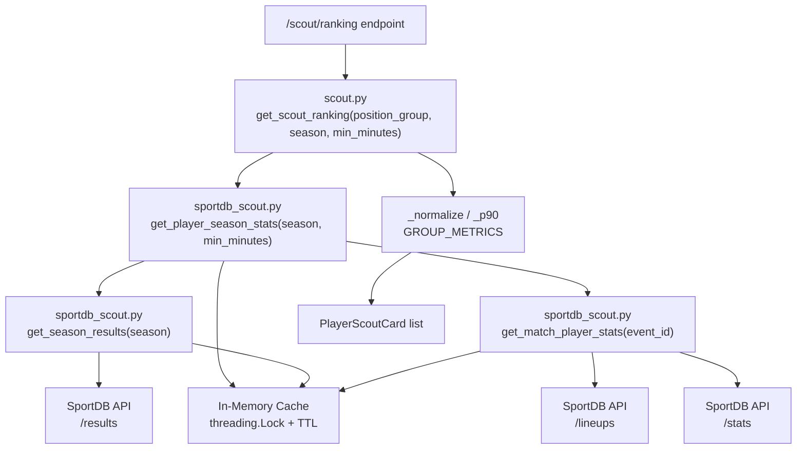

# Design Document — sportdb-scout-migration

## Overview

Esta migração elimina a dependência do banco ESPN (populado por scraper) no sistema de scout/ranking, substituindo-a por dados em tempo real da API SportDB/Flashscore. A mudança é cirúrgica: um novo módulo provider (`sportdb_scout.py`) encapsula toda a lógica de busca e agregação, enquanto `scout.py` perde apenas a camada de acesso a dados, mantendo intacta a lógica de normalização e scoring.

Fluxo atual:
```
banco ESPN → scout.py (SQLAlchemy) → /scout/ranking → frontend
```

Fluxo novo:
```
SportDB API → sportdb_scout.py (cache em memória) → scout.py (normalização) → /scout/ranking → frontend
```

A assinatura pública de `get_scout_ranking` muda minimamente: perde `db: Session` e `competition_id: int`, ganha `season: str = "2026"`. O contrato de retorno (schemas `PlayerScoutCard` / `ScoutRanking`) permanece idêntico.

---

## Architecture



### Decisões de design

- **Cache no provider, não no service**: o cache fica em `sportdb_scout.py` porque é responsabilidade do provider gerenciar latência e rate-limiting da API externa. O service permanece stateless.
- **TTL diferenciado**: Season_Results muda com frequência (novas rodadas) → TTL 2h. Match_Player_Stats de partidas finalizadas são imutáveis → TTL 24h.
- **threading.Lock único**: um único lock protege todo o dicionário de cache, evitando race conditions sem overhead de locks por chave.
- **Resiliência por partida**: falhas em partidas individuais são silenciadas com `continue`, garantindo que uma partida com dados corrompidos não derrube o ranking inteiro.
- **Sem alteração nos schemas**: `PlayerScoutCard` e `ScoutRanking` não mudam, garantindo compatibilidade com o frontend.

---

## Components and Interfaces

### `backend/app/providers/sportdb_scout.py` (novo)

```python
# Cache compartilhado
_cache: dict[str, dict] = {}
_cache_lock: threading.Lock

def _cache_get(key: str) -> Any | None
def _cache_set(key: str, data: Any, ttl_seconds: int) -> None

def get_season_results(season: str = "2026") -> list[dict]
# Retorna lista de todas as partidas finalizadas da temporada (todos os pages).
# Cache TTL: 7200s (2h).

def get_match_player_stats(event_id: str) -> list[dict]
# Retorna lista de jogadores com stats mergeadas para uma partida.
# Cache TTL: 86400s (24h).
# Cada item: {participantId, name, team, positionKey, minutesPlayed,
#             goals, assists, shots, shotsOnTarget, fouls,
#             yellowCards, redCards, saves, rating, goals_conceded}

def _merge_lineup_stats(
    lineups_data: dict, stats_data: list[dict], event_id: str
) -> list[dict]
# Combina lineup (posição, minutos) com stats (métricas) por participantId.
# Jogadores sem stats recebem valores 0 para todas as métricas numéricas.

def get_player_season_stats(
    season: str = "2026", min_minutes: int = 180
) -> list[dict]
# Agrega stats de todas as partidas da temporada por jogador.
# Calcula p90, avg_rating, conversion_rate, save_rate.
# Filtra jogadores com total_minutes < min_minutes.
# Cada item: {player_id, player_name, team_name, positionKey, position_group,
#             total_minutes, matches_played, goals_p90, assists_p90,
#             shots_p90, shots_on_target_p90, fouls_p90, yellow_cards_p90,
#             red_cards_p90, saves_p90, goals_conceded_p90, avg_rating,
#             conversion_rate, save_rate, clean_sheet_rate}
```

### `backend/app/services/scout.py` (modificado)

```python
# Remove: imports SQLAlchemy, POSITION_GROUPS (ESPN), _aggregate_player_stats, _get_goals_conceded

# Adiciona:
SPORTDB_POSITION_GROUPS: dict[str, str] = {
    "GKP": "Goleiro",
    "DEF": "Defensor",
    "MID": "Meio-campo",
    "FWD": "Atacante",
}

# Mantém inalterados: _p90, _normalize, GROUP_METRICS

# Assinatura nova:
def get_scout_ranking(
    position_group: str,
    season: str = "2026",
    min_minutes: int = 180,
) -> list[dict]
```

### Endpoint (sem alteração de contrato)

O endpoint `/scout/ranking` precisa apenas remover os parâmetros `db` e `competition_id` da chamada a `get_scout_ranking`, passando `season` no lugar.

---

## Data Models

### Estrutura interna do cache

```python
_cache = {
    "season_results_2026": {
        "data": [...],          # list[dict] de partidas
        "expires": datetime     # datetime.now() + timedelta(seconds=ttl)
    },
    "match_stats_<event_id>": {
        "data": [...],          # list[dict] de jogadores
        "expires": datetime
    }
}
```

### Registro de jogador em `get_match_player_stats`

```python
{
    "participantId": str,
    "name": str,
    "team": str,
    "positionKey": str,         # "GKP" | "DEF" | "MID" | "FWD"
    "minutesPlayed": int,
    "goals": int,
    "assists": int,
    "shots": int,
    "shotsOnTarget": int,
    "fouls": int,
    "yellowCards": int,
    "redCards": int,
    "saves": int,
    "rating": float | None,
    "goals_conceded": int,      # derivado do placar para goleiros
}
```

### Registro de jogador em `get_player_season_stats`

```python
{
    "player_id": str,           # participantId do SportDB
    "player_name": str,
    "team_name": str,
    "positionKey": str,
    "position_group": str,      # mapeado via SPORTDB_POSITION_GROUPS
    "total_minutes": int,
    "matches_played": int,
    # métricas p90
    "goals_p90": float,
    "assists_p90": float,
    "shots_p90": float,
    "shots_on_target_p90": float,
    "fouls_p90": float,
    "yellow_cards_p90": float,
    "red_cards_p90": float,
    "saves_p90": float,
    "goals_conceded_p90": float,
    # métricas derivadas
    "avg_rating": float,
    "conversion_rate": float,
    "save_rate": float,
    "clean_sheet_rate": float,
}
```

### Mapeamento de posição SportDB → grupo interno

| positionKey SportDB | position_group interno |
|---------------------|------------------------|
| GKP                 | Goleiro                |
| DEF                 | Defensor               |
| MID                 | Meio-campo             |
| FWD                 | Atacante               |
| qualquer outro      | excluído do ranking    |

---

## Correctness Properties

*A property is a characteristic or behavior that should hold true across all valid executions of a system — essentially, a formal statement about what the system should do. Properties serve as the bridge between human-readable specifications and machine-verifiable correctness guarantees.*

### Property 1: Cache hit idempotência

*For any* chamada a `get_season_results` ou `get_match_player_stats` com os mesmos parâmetros, se o cache contém uma entrada válida (dentro do TTL), chamadas subsequentes devem retornar exatamente o mesmo resultado sem realizar novas requisições HTTP.

**Validates: Requirements 1.3, 2.4, 8.1**

---

### Property 2: Cálculo correto de p90

*For any* valor numérico `v` e `minutes > 0`, `_p90(v, minutes)` deve retornar `v / (minutes / 90)`. Para `minutes <= 0`, deve retornar `0.0`.

**Validates: Requirements 3.2, 5.4**

---

### Property 3: Invariantes de _normalize

*For any* lista de valores numéricos, `_normalize` deve retornar uma lista do mesmo tamanho onde todos os valores estão no intervalo `[0.0, 100.0]`. Quando todos os valores de entrada são iguais, todos os valores de saída devem ser `50.0`.

**Validates: Requirements 5.3**

---

### Property 4: Agregação completa de partidas

*For any* temporada com N partidas retornadas por `get_season_results`, `get_player_season_stats` deve processar todas as N partidas ao acumular estatísticas (exceto partidas que retornam erro, que são ignoradas individualmente).

**Validates: Requirements 3.1, 3.7**

---

### Property 5: Métricas derivadas matematicamente corretas

*For any* jogador com `shots > 0`, `conversion_rate` deve ser igual a `goals / shots`. *For any* jogador com `saves + goals_conceded > 0`, `save_rate` deve ser igual a `saves / (saves + goals_conceded)`. *For any* jogador com ratings disponíveis em N partidas, `avg_rating` deve ser igual à soma dos ratings dividida por N.

**Validates: Requirements 3.3, 3.4, 3.5**

---

### Property 6: Filtro por minutos mínimos

*For any* chamada a `get_player_season_stats` com `min_minutes = M`, nenhum jogador com `total_minutes < M` deve aparecer no resultado retornado.

**Validates: Requirements 3.6**

---

### Property 7: Merge de lineup e stats por identificador de jogador

*For any* conjunto de dados de lineup e stats de uma partida, `_merge_lineup_stats` deve retornar exatamente um registro por jogador único presente no lineup, com campos de posição/minutos do lineup e métricas dos stats (ou zeros quando ausentes nos stats).

**Validates: Requirements 2.2, 2.3**

---

### Property 8: positionKey não mapeado implica exclusão

*For any* jogador cujo `positionKey` não esteja em `SPORTDB_POSITION_GROUPS` (i.e., não é GKP, DEF, MID ou FWD), esse jogador não deve aparecer em nenhum resultado de `get_scout_ranking`.

**Validates: Requirements 4.5**

---

### Property 9: Resultado ordenado por score decrescente

*For any* chamada a `get_scout_ranking` que retorna N > 1 jogadores, para todo par de jogadores adjacentes `(i, i+1)` na lista, `score[i] >= score[i+1]`.

**Validates: Requirements 6.5**

---

### Property 10: Campos obrigatórios do PlayerScoutCard presentes

*For any* jogador retornado por `get_scout_ranking`, o dict deve conter os campos `player_id`, `player_name`, `team_name`, `position`, `total_minutes`, `matches_played`, `score` e `metrics`, com tipos compatíveis com o schema `PlayerScoutCard`.

**Validates: Requirements 6.1, 6.2**

---

### Property 11: Métricas p90 são floats não-negativos

*For any* jogador retornado por `get_player_season_stats`, todos os campos de métricas p90 (`goals_p90`, `assists_p90`, `shots_p90`, `shots_on_target_p90`, `fouls_p90`, `yellow_cards_p90`, `red_cards_p90`, `saves_p90`, `goals_conceded_p90`) devem ser do tipo `float` com valor `>= 0.0`.

**Validates: Requirements 8.2, 8.3**

---

## Error Handling

| Situação | Comportamento |
|----------|---------------|
| API SportDB retorna erro HTTP em `get_season_results` | Exceção propagada ao chamador |
| API SportDB retorna erro HTTP em `get_match_player_stats` | Exceção propagada ao chamador |
| Erro ao buscar stats de uma partida individual em `get_player_season_stats` | Partida ignorada com `continue`; demais partidas processadas normalmente |
| `position_group` inválido em `get_scout_ranking` | Retorna lista vazia imediatamente |
| Nenhum jogador atinge `min_minutes` | Retorna lista vazia |
| `positionKey` ausente ou não mapeado | Jogador excluído silenciosamente |
| `total_minutes = 0` em cálculo p90 | `_p90` retorna `0.0` (divisão por zero evitada) |
| `shots = 0` em `conversion_rate` | Retorna `0.0` |
| `saves + goals_conceded = 0` em `save_rate` | Retorna `0.0` |

---

## Testing Strategy

### Abordagem dual

A estratégia combina testes unitários (exemplos concretos e edge cases) com testes baseados em propriedades (cobertura de inputs aleatórios), que são complementares.

**Biblioteca de property-based testing**: `hypothesis` (Python)

### Testes unitários

Focados em exemplos específicos e casos de borda:

- Mapeamento correto de todos os `positionKey` (GKP/DEF/MID/FWD → grupos)
- `positionKey` inválido → jogador excluído
- `position_group` inválido → lista vazia
- Nenhum jogador com minutos suficientes → lista vazia
- `conversion_rate` com `shots = 0` → `0.0`
- `save_rate` com denominador `0` → `0.0`
- `_p90` com `minutes = 0` → `0.0`
- Cache miss → requisição HTTP realizada
- Cache hit dentro do TTL → sem requisição HTTP
- Jogador no lineup sem entrada nos stats → métricas zeradas

### Testes baseados em propriedades

Cada propriedade do design deve ser implementada como um único teste com `@given` do Hypothesis, com mínimo de 100 iterações (`settings(max_examples=100)`).

```python
# Exemplo de tag de referência:
# Feature: sportdb-scout-migration, Property 2: _p90 cálculo correto
@settings(max_examples=100)
@given(v=st.floats(min_value=0, max_value=1e6), minutes=st.floats(min_value=0.1, max_value=1e5))
def test_p90_calculation(v, minutes):
    # Feature: sportdb-scout-migration, Property 2: _p90 cálculo correto
    result = _p90(v, minutes)
    assert abs(result - v / (minutes / 90)) < 1e-9
```

**Mapeamento propriedade → teste**:

| Propriedade | Tag do teste |
|-------------|--------------|
| P1: Cache hit idempotência | `Feature: sportdb-scout-migration, Property 1` |
| P2: _p90 cálculo correto | `Feature: sportdb-scout-migration, Property 2` |
| P3: _normalize invariantes | `Feature: sportdb-scout-migration, Property 3` |
| P4: Agregação completa | `Feature: sportdb-scout-migration, Property 4` |
| P5: Métricas derivadas | `Feature: sportdb-scout-migration, Property 5` |
| P6: Filtro min_minutes | `Feature: sportdb-scout-migration, Property 6` |
| P7: Merge lineup+stats | `Feature: sportdb-scout-migration, Property 7` |
| P8: positionKey não mapeado | `Feature: sportdb-scout-migration, Property 8` |
| P9: Ordenação por score | `Feature: sportdb-scout-migration, Property 9` |
| P10: Campos PlayerScoutCard | `Feature: sportdb-scout-migration, Property 10` |
| P11: Métricas p90 >= 0 | `Feature: sportdb-scout-migration, Property 11` |

### Estrutura de arquivos de teste sugerida

```
backend/tests/
  test_sportdb_scout_provider.py   # P1, P4, P5, P6, P7, P11
  test_scout_service.py            # P2, P3, P8, P9, P10
```
