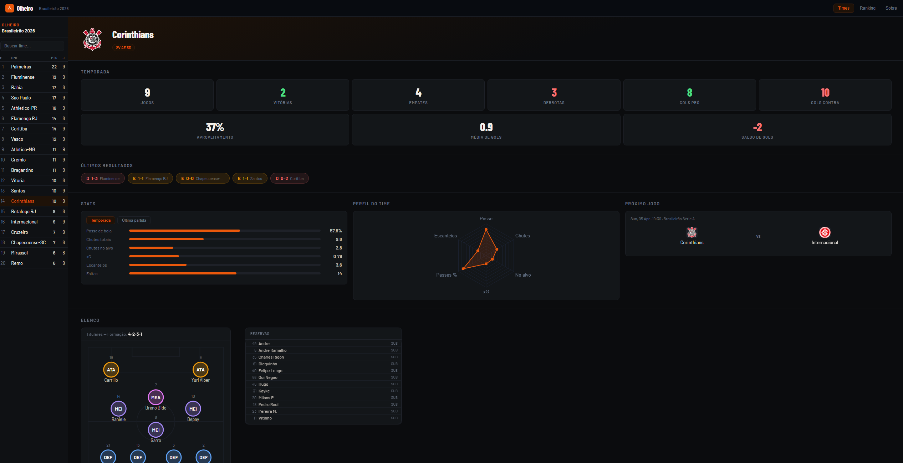

# Olheiro — Análise de Dados · Brasileirão Série A 2026

<p align="center">
  
  
  
  
  
  
  
  
</p>

<p align="center">
  Plataforma de scouting e analytics para o Campeonato Brasileiro, com ranking de jogadores por posição, análise de elenco e identificação de talentos subvalorizados.
</p>

<p align="center">
  <a href="https://scout.alexarnoni.com"><strong>🔗 scout.alexarnoni.com</strong></a>
  &nbsp;·&nbsp;
  <a href="https://scout-api.alexarnoni.com/docs">📄 API Docs</a>
</p>

<p align="center">
  <a href="https://scout.alexarnoni.com">
    
  </a>
</p>

---

## Sobre

O Olheiro é um projeto de portfólio voltado para **Engenharia e Análise de Dados**, construído sobre dados reais do Brasileirão 2026. O objetivo é demonstrar, end-to-end, a construção de uma pipeline de dados — desde a ingestão via API externa até a entrega de métricas analíticas em uma interface web.

O modelo de scout avalia jogadores por posição com métricas **normalizadas por 90 minutos** e aplica um fator de confiança proporcional ao tempo em campo, evitando scores inflados por amostras pequenas. Jogadores com alto score e baixo valor de mercado são sinalizados como **Joias Escondidas**.

---

## Features

- **Perfil de time** — elenco, formação tática, KPIs da temporada e últimos resultados
- **Ranking de jogadores** — top por posição (Goleiro, Defensor, Meio-campo, Atacante) com score, rating e valor de mercado
- **Garimpo (Moneyball)** — índice `score ÷ valor de mercado` para identificar talentos subvalorizados
- **Tabela da competição** — classificação em tempo real via SportDB
- **Radar tático** — visualização das métricas ofensivas/defensivas do time
- **Modal de jogador** — stats detalhados por partida, histórico e perfil

---

## Stack

### Backend
| Camada | Tecnologia |
|---|---|
| API | FastAPI + Uvicorn |
| ORM | SQLAlchemy 2.0 |
| Banco de dados | PostgreSQL 16 |
| Migrations | Alembic |
| Scheduler | APScheduler |
| Containerização | Docker + Docker Compose |

### Frontend
| Camada | Tecnologia |
|---|---|
| Interface | HTML / CSS / JavaScript (Vanilla) |
| Tipografia | Barlow Condensed + Barlow (Google Fonts) |
| Gráficos | Chart.js 4 |
| Deploy | Cloudflare Pages (auto-deploy via git push) |

### Infraestrutura
| Componente | Tecnologia |
|---|---|
| Servidor | Oracle Cloud VM (Ubuntu) |
| Reverse proxy | Nginx + SSL (Let's Encrypt) |
| Firewall | UFW + Fail2ban |
| Fonte de dados | SportDB API (`X-API-Key`) |

---

## Arquitetura

```
┌─────────────────────────────────────────────────────────┐
│                     Cloudflare Pages                    │
│                  frontend/ (HTML/CSS/JS)                │
└───────────────────────┬─────────────────────────────────┘
                        │ HTTPS
┌───────────────────────▼─────────────────────────────────┐
│               Oracle Cloud VM (arnoni-cloud)             │
│                                                          │
│  ┌─────────────────────────────────────────────────┐    │
│  │  Nginx (reverse proxy + SSL termination)        │    │
│  └──────────────┬──────────────────────────────────┘    │
│                 │                                        │
│  ┌──────────────▼──────────────────────────────┐        │
│  │  scout-backend (FastAPI / port 8001)        │        │
│  │                                             │        │
│  │  providers/                                 │        │
│  │    sportdb.py       ← standings, fixtures   │        │
│  │    sportdb_scout.py ← player stats          │        │
│  │                                             │        │
│  │  services/                                  │        │
│  │    scout.py  ← ranking stateless (no DB)   │        │
│  │                                             │        │
│  │  routers/                                   │        │
│  │    teams, matches, scout, standings         │        │
│  └──────────────┬──────────────────────────────┘        │
│                 │                                        │
│  ┌──────────────▼──────────────────────────────┐        │
│  │  scout-postgres (PostgreSQL 16 / port 5433) │        │
│  └─────────────────────────────────────────────┘        │
│                                                          │
└──────────────────────────┬──────────────────────────────┘
                           │ X-API-Key
               ┌───────────▼───────────┐
               │     SportDB API       │
               │  (results, lineups,   │
               │   player stats)       │
               └───────────────────────┘
```

---

## Decisões técnicas

**Por que SportDB em vez da ESPN?**
O projeto começou consumindo endpoints informais da ESPN. Funcionava, mas era frágil: sem autenticação, sem garantia de estabilidade e sujeito a quebrar sem aviso. A migração para a SportDB resolveu isso com uma API documentada, autenticada via `X-API-Key` e com endpoints dedicados para lineups, player stats e standings. O custo foi refatorar os providers e os scripts de seed, mas o resultado é uma base muito mais confiável para um portfólio sério.

**Por que o ranking é stateless?**
O endpoint `/scout/ranking` não toca o banco de dados. Ele busca resultados e stats diretamente da SportDB em tempo real, calcula os scores na memória e retorna. A alternativa seria persistir as métricas de cada jogador no PostgreSQL e manter um job de atualização, mas isso adiciona complexidade de sincronização sem benefício real nessa fase. Com cache em memória de 2h para stats de temporada, a performance é boa e o modelo fica simples de iterar.

**Por que Cloudflare Pages para o frontend?**
O frontend é 100% estático: HTML, CSS e JS vanilla, sem build step. O Cloudflare Pages faz deploy automático a cada `git push`na pasta `frontend/`, com CDN global e SSL incluso. Não faz sentido subir um servidor só para servir arquivos estáticos quando isso é resolvido em zero configuração.

**Por que vanilla JS em vez de React/Vue?**
O projeto tem uma única SPA com navegação simples entre três páginas. Adicionar um framework traria build tooling, bundler e complexidade de estado para um problema que `fetch` + `innerHTML` resolve com 200 linhas. A escolha mantém o foco nos dados, que é o ponto do portfólio, e não na infraestrutura de frontend.

---

## Modelo de Scout

O score de cada jogador é calculado em duas etapas:

**1. score_raw** — média das métricas normalizadas (min-max 0–100 dentro do grupo de posição)

**2. score final** — `score_raw × confidence`, onde `confidence = minutos_jogador / max_minutos_do_grupo`

Isso penaliza amostras pequenas sem excluir jogadores com poucos jogos.

### Métricas por posição

| Posição | Métricas |
|---|---|
| Goleiro | save_rate, avg_rating, goals_p90_inv, yellow_cards_p90_inv |
| Defensor | goals_p90, assists_p90, shots_p90, fouls_p90_inv, yellow_cards_p90_inv, avg_rating |
| Meio-campo | goals_p90, assists_p90, shots_p90, shots_on_target_p90, fouls_p90_inv, yellow_cards_p90_inv, avg_rating |
| Atacante | goals_p90, assists_p90, shots_p90, shots_on_target_p90, conversion_rate, xg_p90, yellow_cards_p90_inv, avg_rating |

---

## Setup local

### Pré-requisitos

- Docker + Docker Compose
- Python 3.11+
- Chave de API do [SportDB](https://api.sportdb.dev)

### 1. Clonar e configurar variáveis

```bash
git clone https://github.com/alexarnoni/Scout.git
cd Scout
cp backend/.env.example backend/.env
# Editar backend/.env com DATABASE_URL e SPORTDB_API_KEY
```

### 2. Subir o banco

```bash
cd infra
docker compose up -d
```

### 3. Instalar dependências

```bash
cd backend
pip install -r requirements.txt
```

### 4. Rodar migrations

```bash
cd backend
alembic upgrade head
```

### 5. Seed inicial

```bash
python -m scripts.seed_layer0
```

Cria a competição "Brasileirao 2026" e os times no banco.

### 6. Subir a API

```bash
uvicorn app.main:app --reload --port 8001
```

---

## Deploy (produção)

### Backend

```bash
# Build e restart com força-recreate (necessário para .env changes)
sudo docker compose -f /opt/scout/infra/docker-compose.yml up -d --build backend
```

### Frontend

Deploy automático via Cloudflare Pages a cada `git push` na pasta `frontend/`.

---

## Estrutura do projeto

```
Scout/
├── docs/
│   └── screenshot.png              # Preview da interface
├── backend/
│   ├── app/
│   │   ├── core/config.py          # Settings e DATABASE_URL
│   │   ├── models/                 # SQLAlchemy ORM models
│   │   ├── providers/
│   │   │   ├── sportdb.py          # Standings, fixtures, lineups
│   │   │   └── sportdb_scout.py    # Player stats por partida
│   │   ├── services/
│   │   │   ├── scout.py            # Ranking stateless (sem DB)
│   │   │   └── persistence.py      # Upsert e parsing compartilhados
│   │   └── routers/                # Endpoints FastAPI
│   ├── scripts/
│   │   ├── seed_layer0.py          # Seed inicial
│   │   ├── sync_date.py            # Sync de uma data
│   │   ├── backfill.py             # Backfill de intervalo de datas
│   │   └── scheduler.py            # Scheduler diário (APScheduler)
│   └── alembic/                    # Migrations
├── frontend/
│   └── index.html                  # SPA principal
└── infra/
    └── docker-compose.yml
```

---

## Variáveis de ambiente

| Variável | Descrição |
|---|---|
| `DATABASE_URL` | Connection string PostgreSQL |
| `SPORTDB_API_KEY` | Chave de autenticação da SportDB API |
| `SCOUT_COMPETITION_ID` | ID da competição no banco (default: `1`) |

---

## Roadmap

| # | Feature | Status |
|---|---|---|
| 1 | **dbt** — transformações em camadas (`stg_matches` → `mart_player_season`) |  |
| 2 | **Airflow** — substituir APScheduler por DAGs orquestradas |  |
| 3 | **Copa do Mundo 2026** — página dedicada com grupos, convocados e fixtures |  |
| 4 | **PWA** — manifest + service worker para instalação mobile |  |
| 5 | **Métricas avançadas** — Índice de Pressão, Consistência Ponderada, Índice de Revelação |  |

---

## Licença

Distribuído sob a licença MIT. Veja [`LICENSE`](LICENSE) para mais detalhes.

---

## Autor

**Alexandre Arnoni** — Data Analyst · em transição para Data Engineering

<p>
  <a href="https://linkedin.com/in/alexarnoni">
    
  </a>
  &nbsp;
  <a href="https://github.com/alexarnoni">
    
  </a>
  &nbsp;
  <a href="https://scout.alexarnoni.com">
    
  </a>
</p>
